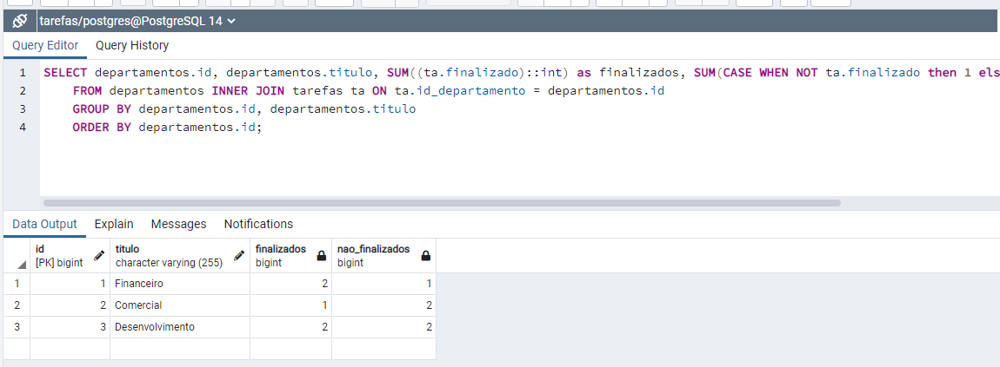
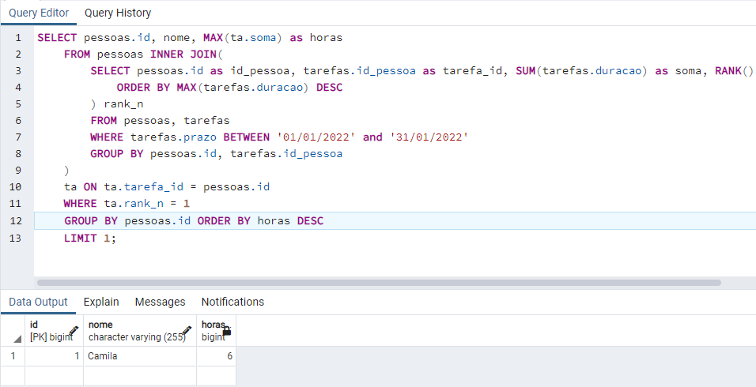
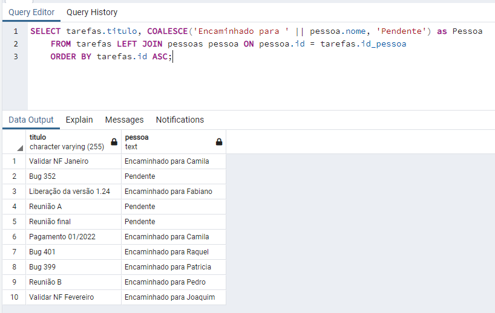
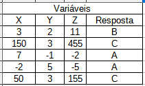

# PerinityTest
Desafio da Perinity

### PARTE 1

<b>Necessário utilizar banco de dados PostgresSQL com um database chamado 'tarefas'.</b>

Ao executar o projeto será possivel acessar documentação por este caminho: [localhost:8080/swagger-ui.html](http://localhost:8080/swagger-ui.html)

Funções implementadas:

- Adicionar um pessoa (post/pessoas)

- Alterar um pessoa (put/pessoas/{id})

- Remover pessoa (delete/pessoas/{id})

- Adicionar um tarefa (post/tarefas)

- Alocar uma pessoa na tarefa que tenha o mesmo departamento (put/tarefas/alocar/{id})

- Finalizar a tarefa (put/tarefas/finalizar/{id})

- Listar pessoas trazendo nome, departamento, total horas gastas nas tarefas.(get/pessoas)

- Buscar pessoas por nome e período, retorna média de horas gastas por tarefa. (get/pessoas/gastos)

- Listar 3 tarefas que estejam sem pessoa alocada com os prazos mais antigos. (get/tarefas/pendentes)

- Listar departamento e quantidade de pessoas e tarefas (get/departamentos)

### PARTE 2

##### ENTIDADES FORAM ALTERADADS DE camelCase PARA snake_case PARA EVITAR PROBLEMAS COM API

Os Scripts de Select podem ser acessados na pagina PARTE 2

Os scripts estão com a sintaxe do PostgresSQL

##### Q: Montar select que retorne nome do departamento, quantidade de tarefas finalizadas e quantidade de tarefas não finalizadas

```SQL
SELECT departamentos.id, departamentos.titulo, SUM((ta.finalizado)::int) as finalizados, SUM(CASE WHEN NOT ta.finalizado then 1 else 0 end) as nao_finalizados
	FROM departamentos INNER JOIN tarefas ta ON ta.id_departamento = departamentos.id
	GROUP BY departamentos.id, departamentos.titulo
	ORDER BY departamentos.id;
```

 <hr>
 
 ##### Q: Retornar a pessoa que mais gastou horas em janeiro de 2022
 
```SQL
SELECT pessoas.id, nome, MAX(ta.soma) as horas
	FROM pessoas INNER JOIN(
		SELECT pessoas.id as id_pessoa, tarefas.id_pessoa as tarefa_id, SUM(tarefas.duracao) as soma, RANK() OVER(
			ORDER BY MAX(tarefas.duracao) DESC
		) rank_n
	 	FROM pessoas, tarefas
		WHERE tarefas.prazo BETWEEN '01/01/2022' and '31/01/2022'
		GROUP BY pessoas.id, tarefas.id_pessoa
	)
	ta ON ta.tarefa_id = pessoas.id
	WHERE ta.rank_n = 1
	GROUP BY pessoas.id ORDER BY horas DESC
	LIMIT 1;
```


<hr>

##### Q: Select que retorne título da tarefa, prazo, se tiver pessoa alocada na tarefa exibir como “Encaminhado para + nome do pessoa” caso contrário “Pendente” e total de horas que essa pessoa já gastou. Ordenar por prazo decrescente. 

```SQL
SELECT tarefas.titulo, COALESCE('Encaminhado para ' || pessoa.nome, 'Pendente') as Pessoa
	FROM tarefas LEFT JOIN pessoas pessoa ON pessoa.id = tarefas.id_pessoa
	ORDER BY tarefas.id ASC;
```


### PARTE 3

1. 

Os outros algoritmos podem ser acessados na pasta [PARTE 3](https://github.com/malysonb/PerinityTest/tree/main/Parte3), Assim como suas implementações em java.
